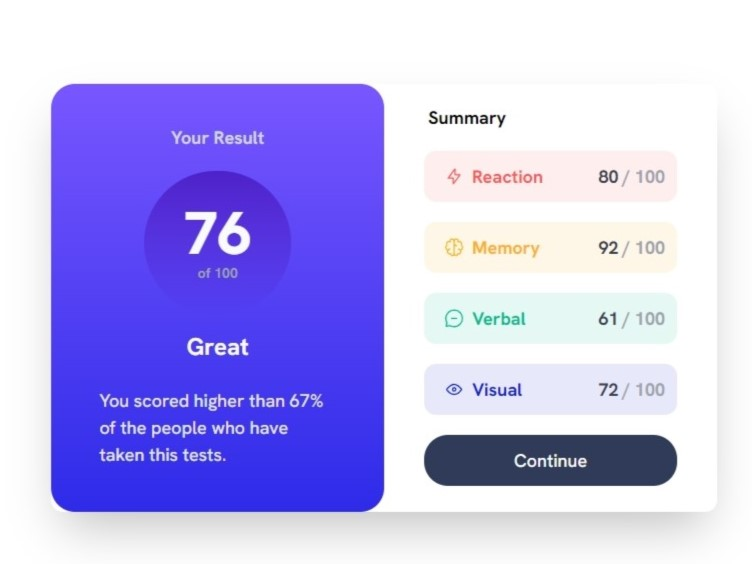
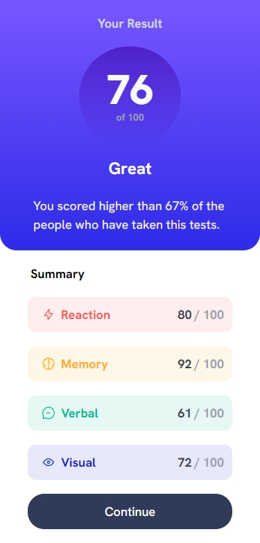

# Frontend Mentor - Results summary component solution

This is a solution to the [Results summary component challenge on Frontend Mentor](https://www.frontendmentor.io/challenges/results-summary-component-CE_K6s0maV). Frontend Mentor challenges help you improve your coding skills by building realistic projects. 

## Table of contents

- [Overview](#overview)
  - [The challenge](#the-challenge)
  - [Screenshot](#screenshot)
  - [Links](#links)
- [My process](#my-process)
  - [Built with](#built-with)
  - [What I learned](#what-i-learned)
  - [Continued development](#continued-development)
- [Author](#author)

## Overview

A simple challenge to create a results summary page with different designs in mobile/desktop resolutions.

### The challenge

Users should be able to:

- View the optimal layout for the interface depending on their device's screen size
- See hover states for all interactive elements on the page

### Screenshots





### Links

- Solution URL: [Add solution URL here](https://your-solution-url.com)
- Live Site URL: [Add live site URL here](https://your-live-site-url.com)

## My process

### Built with

- Semantic HTML5 markup
- Mobile-first workflow
- [React](https://reactjs.org/) - JS library
- [TailwindCSS](https://tailwindcss.com) - For styles

### What I learned

Since this code is fairly simple, just letting a snippet about how is possible to manage the breakpoints using TailwindCSS:

```jsx
function App() {

  const [myData, setMyData] = useState(data);

  return (
    <div className="sm:h-screen flex flex-col sm:flex-row items-center justify-center font-sans text-[18px] bg-white">
      <div className="sm:flex sm:shadow-2xl sm:rounded-xl">
        <FinalResult rawData={myData}/>
        <Summary rawData={myData}/>
      </div>
    </div>
  );
}
```
Each component is a container and its shown differently if its on the `sm` breakpoint (`min-width: 640px`) or not. Since the shadows are only in the desktop version, both are constrained to the small breakpoints in a separated `div`.

### Continued development

A good idea for continued development in this project is to simplify the summary component to generate the different topics based only in the JSON data.

## Author

- Github - [Vinícius (volinha)](https://github.com/volinha)
- Frontend Mentor - [@volinha](https://www.frontendmentor.io/profile/volinha)
- Twitter - [@volafernandes](https://www.twitter.com/volafernandes)
